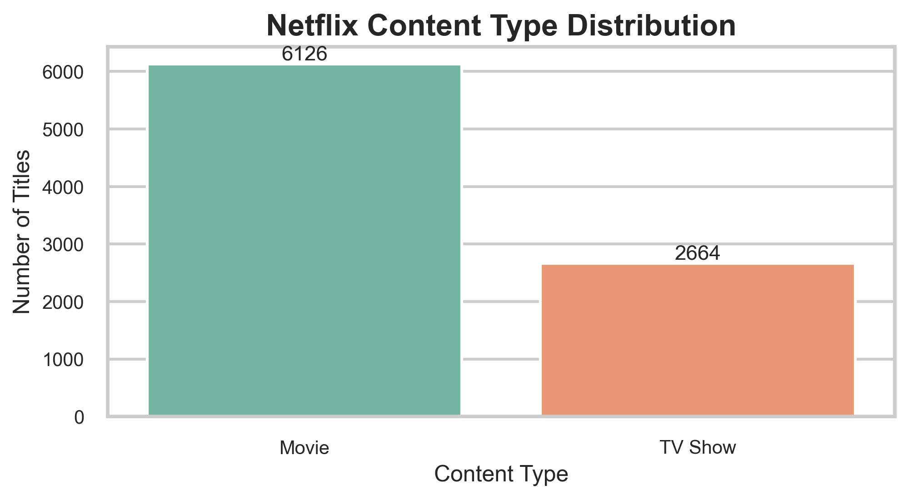
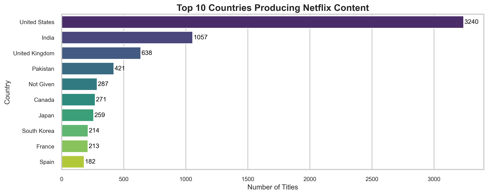
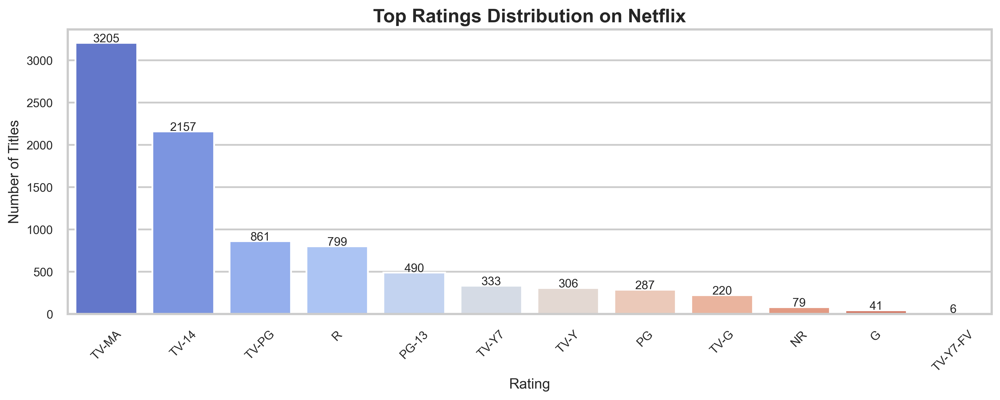
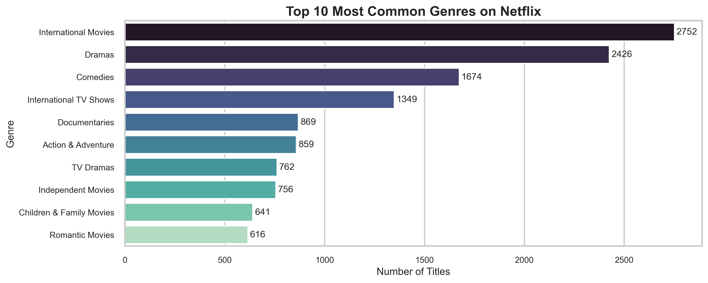

# Netflix Data Analysis

This project is a Python-based Exploratory Data Analysis (EDA) on the Netflix Movies & TV Shows dataset.
The main goal is to understand Netflix content patterns like Movies vs TV Shows ratio, country distribution,
popular genres, ratings, and year-wise trends using clean visualizations.

---

## What I did in this project

- Loaded and explored the dataset
- Cleaned missing values and formatted important columns (especially `date_added`)
- Created useful features like `year_added`
- Performed EDA and visualization using Matplotlib/Seaborn
- Wrote key insights based on trends (countries, genres, ratings, duration)

---

## Dataset

The dataset is a CSV file containing Netflix titles with metadata such as:
`type`, `title`, `director`, `country`, `date_added`, `release_year`, `rating`, `duration`, `listed_in`.

---

## Tools used

- Python
- Jupyter Notebook
- Pandas, NumPy
- Matplotlib, Seaborn

---

## Main graphs included

- Movies vs TV Shows distribution  
- Titles released over the years  
- Top 10 content producing countries  
- Ratings distribution  
- Top 10 genres on Netflix  
- Movie duration distribution  

(Charts are saved inside the `images/` folder.)

---

## Key takeaways

- Netflix has more Movies than TV Shows in this dataset.
- Content releases increased heavily after 2015.
- USA and India contribute a major portion of Netflix content.
- TV-MA and TV-14 are the most common ratings.
- Genres like International Movies, Dramas, and Comedies appear frequently.
- Most Netflix movies fall between 80–120 minutes duration.

---

## Challenges I faced

- Missing values in columns like `director`, `country`, and `rating`
- Converting `date_added` into datetime format for time-based analysis
- The genre column contains multiple values, so splitting + exploding was required
- Duration column had mixed formats (minutes for movies and seasons for TV shows)

---
## Project folder Structure

Netflix-Data-Analysis/
│── notebook/        # Jupyter notebook file
│── data/            # dataset (CSV)
│── images/          # saved output charts
│── README.md

---

## Sample Visualizations

### Movies vs TV Shows

### Top 10 Countries

### Ratings Distribution

### Top Genres

---

## Author

Aparna Patel

  

